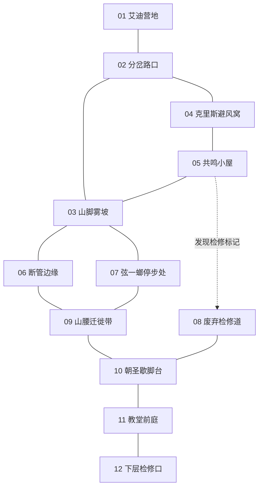

# 腐蚀世界｜山的呼吸：三天玩法切片节点设计草案

日期：2026-10-08  
状态：供评审的内容提案，尚未实现，不自动成为项目定案。

依据：本轮附件《腐蚀世界_2026-09-28_设计共识增量(1).md》《项目现状与业务需求落地参考_2026-10-08.md》，以及本轮已选方向三“山的呼吸”。沿用当前对虫人尺度、旧金属管道与沉积山体的讨论；这里的环境机制是虚构世界设计，不是现实管道工程说明。

## 1. 切片要完成什么

主角的目标始终是到山顶教堂寻找离开的办法。上山过程中，问题依次变化：

1. 有人上得去，我为什么付不起这个代价？
2. 同一路线的生还经验为什么彼此矛盾？
3. 金属声、气流与怪群迁移之间有什么可验证的关系？
4. 教堂是否掌握这套规律？为什么它没有成为所有人的避难所？
5. 空气能经过教堂向外流动，但身体到底要从哪里离开？

切片收束在确认“教堂非直接出口”、揭示教堂下方检修入口，并明确下一阶段要调查的对象。完整离开机制和厄运的目标仍留给后续流程。

## 2. 保留规则与范围

- 五天感染期限，血肉不延寿；防护只减少本次环境损耗，不治疗开局的深度感染。
- 只有长休推进日期。移动、观察、战斗与局部呼吸阶段不推进日期。
- 长休仍可从地图发起，不新增“必须回艾迪营地才能休息”的要求。
- 未探索节点首次进入消耗1体力；已探索的安全路线可免费往返。
- 行动卡实际投入产生疲劳；知识不消耗，不把线索做成永久任务卡。
- 同名卡副本疲劳独立计算，疲劳可累积；不简化成“整张模板仅疲劳一次”。
- 完整身体可以通行，不要求献祭，不要求某个NPC活着。
- 山路始终可通；改变的是代价、局部威胁与掌握信息的程度。
- “三天”是首轮游玩的预期内容量，不是必须完成三次日历任务。熟练玩家可以更早抵达。
- 12个节点中，基础主路约8个，4个分支节点按需要选择；首次游玩通常访问10—11个。
- 本稿不展开完整经济、角色关系值、全球模拟或新卡系。

## 3. “呼吸”的最小玩法模型

需要同时表现两种变化：

- 呼吸周期：某次穿越遭遇内部的局部阶段。
- 天数恶化：长休后，某些节点、人物和资源发生持久变化。

二者不能混成“等到第三天，路才开放”。

### 3.1 三种可见征兆

| 阶段 | 肉眼与耳朵可见的信息 | 场景含义与可用行动 |
|---|---|---|
| 静滞 | 闷响停歇，雾贴地，零星刮擦来自菌层下 | 看似安静，但怪群正在分散搜食。沿主路强闯容易连续遭遇 |
| 回吸 | 细响连续，灰絮朝裂口收拢，边缘布条指向裂口 | 裂口旁的外缘短时薄雾；靠近裂口中心仍危险。可走贴壁路线，或利用怪群向低处迁移 |
| 喷发 | 一次重响，灰絮向外顶开，菌层翻动 | 孢雾向外喷涌，怪物被逼出藏身处；应退入凹槽、走检修旁道，或付出高代价硬闯 |

阶段不是秒级实时计时器。进入山腰穿越事件时显示当前征兆，玩家选择“观察、试探、穿越、躲入凹槽、退出”。躲入凹槽会推进局部阶段，不推进日期；同一次穿越只结算一次等待成本，不允许无限等待刷奖励。

首轮建议：等待整个循环耗1体力，不消耗长休机会；资源不足可以退出，或选择付HP/战斗的通行方式。具体HP值留给平衡验证，不在内容稿中写死。

知识的价值是读懂征兆、选对路径、减少试探损耗。玩家拿到知识后仍要处理剩余敌人、疲劳和防护分配，不把“等一等”做成全程无代价解。

高位节点另有自己的气流方向与危险边界。山腰经验可以帮助观察，不可直接套用；现场必须明确呈现差异，不做无提示的反杀。

### 3.2 知识的分工

| 知识 | 解决什么 | 主要来源 | 替代来源 |
|---|---|---|---|
| 回吸征兆 | 从声音与灰絮辨认局部薄雾窗口 | 克里斯的持续观察 | 共鸣小屋中的记录，加断管边缘实证 |
| 外缘落脚 | 知道薄雾不等于裂口中心安全 | 断管边缘的现场试探 | 弦一螂的经验 |
| 检修旁道 | 知道稳定但昂贵的替代路线 | 共鸣小屋的旧标记 | 弦一螂指出入口，并由现场验证 |

三种知识各有作用；通关不要求集齐三份。主路线采用回吸征兆与外缘落脚，检修路采用旁道知识与防护，强闯以战斗和补给付费。任何关键NPC死亡后，现场证据仍保留通行可能。

## 4. 节点空间关系

连线表示可往返的空间连接，不表示剧情必须按箭头顺序执行。虚线表示经过发现才显示的检修旁道。

分岔路口—避风窝—共鸣小屋—雾坡构成下部回路；山腰主路与废弃检修道形成两条上山路线。弦一螂所在分支接回主路，不要求原路折返才能继续。

## 5. 节点逐项拆分

### 01 艾迪营地：目标与第一份不完整经验

**首次可见：** 远处有教堂轮廓。艾迪见过有人上下山，提醒主角先别把体力耗在雾坡；他知道金属声，却不知道精确规律。

**玩家能做：**
- 询问路线、感染与往返者。获得宏观目标和两个初始方向：雾坡、附近的避风窝。
- 获得已有诱饵肉；查看一套打捞来的破损防护用品。
- 后续可以把从山上获得的征兆知识交给艾迪，让他有依据改善营地外出方式。

**资源与后果：** 防护提案采用一次穿雾用的“修补防护包”，不是全套新装备系统。艾迪指出部件缺失，配件可从共鸣小屋取得；拿走营地已有的完整备用包则需要明确交换成本，并影响其次日可外出打捞的次数。这是新增内容，不是当前已实现交易。

**重访：** 长休后补给与外围雾线可发生变化；艾迪说明变化不代表所有山路都关闭。这里不要求玩家解决营地危机才准上山。

### 02 分岔路口：让矛盾变得具体

**首次可见：** 女性托马斯在路口喘息；现场有粪怪和可破坏的场地结构。她说自己“等金属声停了才走”，仍遭伏击。

**玩家能做：**
- 对粪怪使用暴力，主动战斗并获得既有抢攻优势。
- 对托马斯投入保护行动，留下能继续交流的人。
- 对场地使用手段或诱饵，将威胁转移到旁支。
- 观察怪物和人，获得“安静并不等于安全”的初步信息。

**后果：** 诱导到的地点必须明确标注，不能将怪物从地图上免费抹除。保护或绕过都会留下不同人物状态。托马斯死亡也不删除主线知识来源。

**重访：** 后来可以告诉她正确征兆、只给含糊建议、交出防护，或不给帮助。她后续行动读取实际帮助，不根据“好感高”自动成功登山。

### 03 山脚雾坡：让玩家决定还缺什么

**首次可见：** 主路上有零散粪怪；山腰裂口可见雾流与布条。这里能看见危险，但还不确定它何时最小。

**玩家能做：**
- 初次试探一小段，承受一次轻度环境损耗或短战，得到“同一路段状态会变”的实证。
- 观察气流，发现断管边缘的落脚位置。
- 不试探，直接前往断管边缘，或转去寻找克里斯、防护、弦一螂。
- 准备充分者可以向山腰继续，知识不作为通行的硬门槛。

**后果：** 试探不得重复扣费或刷奖励；返回时保留已经识别的危险。这里的提示应说明高风险穿越仍然可行，不显示一把必须取得的“知识钥匙”。

### 04 克里斯避风窝：证词必须能被验证

**首次可见：** 克里斯躲在管壁凹处，睡不着。墙上记录了连续细响、一次重响、灰絮方向等记号。他能描述现象，但不是全知的管道工程师。

**玩家能做：**
- 听取他的观察，获得回吸征兆知识。
- 用观察行动核对记录与现场，得到共鸣小屋位置，或确认他描述的信号可信。
- 取得他保存的一片干燥防护材料，或留下给他继续使用。
- 抢夺资源、攻击或离开；知识仍有替代出处。

**后果：** 拿走保护材料会降低他次日保持观察点的能力。提供材料或正确避险建议可以使他继续补充记录。不能只以“跟他聊过”判定已经救了他。

**重访：** Day 2 起，若避风点受雾流侵入，他退到同节点的高处夹层；观察点改变，旧记录仍可读。先做同节点状态变体，不扩展完整自主移动系统。

### 05 共鸣小屋：拆穿一种错误解释

**首次可见：** 声音像有人在里面敲杯。部分山下人将它当成钟声或召唤。

**玩家能做：**
- 沿用现有“菌雾里的金属声”的调查体验，查清手腕、金属杯与气流的关系。
- 观察不同时段的杯响和灰絮，发现细碎共鸣与远处重响不是同一个声源。
- 搜索一次，沿用现有小屋额外1体力的搜查结构，获得修补配件与残存路线记录。
- 对绳、杯、裂缝等场地对象行动，可以让局部声响停止，或改成以后可辨识的指示物。

**知识：** 与断管边缘实证结合，补足回吸征兆；旧检修符号揭示08入口。

**后果：** 玩家拿走杯、拆毁标记与保留指示会改变后来者得到的信息。既有金属声事件只揭示原型声源，不包含这些气流与旁道功能；本稿需要明确扩写或新建后续事件，不能声称已实现。

### 06 断管边缘：用小代价验证，而非让玩家盲赌

**首次可见：** 裂口中心灰絮急剧收拢，外缘则有一条清晰落脚带。坏掉的布条与半陷泥中的登山者遗物都在可操作范围内。

**玩家能做：**
- 对布条和灰絮使用观察，验证回吸征兆。
- 用手段固定试探绳，判断贴壁位置；用执念稳住身体取回遗物；用暴力切断或破坏障碍。
- 留下绳或正确标记，降低后来者探索成本。
- 直接拿走绳与防护部件，保留自身资源但让安全指示消失。

**奖励：** 外缘落脚知识；一次性防护配件；可选装备或补给只择其一小规模配置，不堆满奖励。

**后果：** 它是相对可控的练习节点。观察与试探会产生卡副本疲劳，马上进入山腰战斗时要承受这份代价。失败可以撤退，不用一次错误直接杀死角色。

### 07 弦一螂停步处：证明走得通

**首次可见：** 他能辨认气流，并有反复上山的痕迹。他停在这里有自身取舍，不是被封路困住；本切片不完成他的完整个人故事。

**玩家能做：**
- 获得外缘落脚或检修入口提示，验证经验与现场关系。
- 进行一次有限的训练或交流，得到一件装备或一种既有卡牌能力的固定来源。
- 以资源换取一段清理帮助，只减少山腰的一场威胁，不替玩家走完整条路。
- 对战或离开。

**后果：** 若给予清理帮助，他自身会消耗或受伤；击杀只给正常资源，不增加天数。帮助、训练、对战都是可选扩展，第一版优先做信息与单项奖励。

**重访：** 保留人物选择，不写成玩家没来就永远僵在这里的门锁。

### 08 废弃检修道：知识不足仍能到达

**发现：** 共鸣小屋的标记或弦一螂的提示揭示入口；不知道入口时可在关联地点通过明确探索选项找到，付额外体力。

**首次可见：** 管壁内侧的旧通道相对避开喷雾，但狭窄，有泥堵和固定伏击点。

**玩家能做：**
- 用手段借工具通过泥堵，承受疲劳或消耗防护包。
- 用暴力开路，惊动少量敌人并留下较容易重访的通道。
- 用执念硬撑，通过后扣HP；完整身体加成可帮助承受，但不是特殊通行资格。
- 没有合适资源时退出，改走山腰主路。

**结果：** 到达10，绕过09。建议比知识路线多一次明确消耗或一次额外小战，不同时叠满所有惩罚。旁道更稳定但更贵，不是各方面都差的失败路线。

**重访：** 已打开的障碍保持；已击败的固定敌人不自动重生。

### 09 山腰迁徙带：主切片的综合考验

**首次可见：** 怪群在菌层间迁移，金属声与雾流直接影响它们的去向。这里使用三阶段呼吸遭遇。

**玩家能做：**
1. 识别回吸征兆，沿外缘穿过，再处理留下的少量敌人。
2. 用防护包承受雾流，结合战斗穿越。
3. 用诱饵或环境声音把一部分怪群引向指定旁支，减少当前战斗。
4. 正面打穿，以补给和战斗力付费。
5. 退入凹槽，付一次等待成本转入更合适阶段；或直接退出。

**对象化输入：** 怪群、导流/共鸣物、贴壁路径。攻击怪群启动战斗；作用于共鸣物可改变一部分怪群去向；保护自己减少穿雾损耗。不能让所有行动都只得到“战斗强度减一”。

**跨节点后果：** 诱导目的地明确为03外围或06落脚带，玩家可选但需提前知道可能影响谁。陷阱与声音只控制局部群体，不制造“全岛粪怪听一声就迁移”的规则。

**通行结果：** 所有有效路线到10。记录方法、局部威胁去向、剩余防护与标记，供后续人物读取。逃跑保留HP和疲劳损耗，避免重复拿资源。

### 10 朝圣歇脚台：看到自己的办法如何影响别人

**首次可见：** 这里有使用多次的补给痕迹、朝圣者遗物和朝向教堂的拖运印记。人们早已往返，不是主角第一个打通山路。

**玩家能做：**
- 读出运输者对征兆的成熟运用；确认山下流传的简单口诀遗漏了关键细节。
- 遇见另一位登山者，或Day 3到达的托马斯。
- 分配剩余防护与补给，告知正确路线，拿走遗物，或先行离开。
- 观察高位气流，发现它与山腰局部裂口方向不同。

**人物状态：** 托马斯只有在得到可用路线和足够通行资源、且没有被转移威胁击中时，才可能到这里；只收到一句“听钟声再走”会受伤、折返或留在山下。首版只做两三个清楚分支，避免排列组合失控。

**知识推进：** 这里的记录与11的设施互相印证，说明教堂长期掌握规律。不能只在教堂一次性用长对白灌输全部答案。

### 11 教堂前庭：清洁不等于获救

**首次可见：** 风向更稳定，教堂维护者在处理进气/防雾构件。玩家能得到短暂安全，却看不到一个允许身体直接飞升的洞口。

**玩家能做：**
- 展示对征兆的理解，换取更明确的设施信息。
- 通过遗物、拖运痕迹和维护构件自行调查。
- 以交换、胁迫、绕行等方式接近下层检修口；不强制成为信徒或献祭。
- 已建立的良好关系可降低成本，但没有关系也能推进。

**揭示：** 教堂利用或维护管道运行，与山腰“呼吸”有关；这只能证明现象的联系，不在本切片宣布神力全是骗局。防护不能逆转深度感染。

**下一目标：** 教堂地面的连接向下延伸，维护者与货物也从那里进出。主角需要追查身体可通过的机构，而不是继续等一阵清风。

### 12 下层检修口：前三天的收束

**首次可见：** 一个可开启或绕入的下层入口，通向可听见运行声的管道内部；有蛛丝、留置标记或异常维护痕迹，作为厄运相关线索。

**玩家能做：**
- 根据沿途知识确认这里与山腰运行相关。
- 通过维护提示、现场工具或暴力开口，揭示下一阶段区域；不要求唯一NPC给钥匙。
- 判断光源与毒抗/防护的需求，把需求作为下一阶段的可准备目标。

**切片结果：** 完成“到达教堂并找到真正终局方向”，不直接逃离异位面。保留主角身体、日期、资源、人物与世界后果，作为后续切片输入。

## 6. 三天预期节奏与体力

这是建议路线，不是唯一顺序。下表以每次长休体力恢复6为基线；不将首次到达立即战斗机械计为探索1加战斗1。

| 日期 | 典型访问 | 预期体力用途 | 当天得到的主线推进 |
|---|---|---|---|
| Day 1 | 01→02→03；再去04 | 4次首次探索，余2留给试探、献祭或分支。若起点配置已探索01，预算相应减少 | 明确目标、见到矛盾经验、得到一份可验证征兆 |
| Day 2 | 05→06→09→10 | 4次首次探索+小屋搜索1+穿越等待或额外行动1。直达战斗复用探索成本 | 验证规律、实际过山腰、看到其他登山者的代价 |
| Day 3 | 11→12；穿插安全路网重访或补充分支 | 主路2次首次探索，其余用于高位调查、人物后果和备用路线 | 抵达教堂、确认假终点、揭示下层方向 |

调整：
- 选择07通常替代05的资源分支或部分调查，不要求两条都做。
- 选择08从05直接上到10，替代06与09主路，不与其叠成必做清单。
- Day 2若HP与疲劳状态良好，可以继续进11/12；提前抵达不阻止切片完成。
- 探索更多可选内容自然推迟到Day 3。不要为了保证第三天才到，锁定出口或强制等待日历。
- 日期预算只保证规模合理；最终仍需实际试玩检验HP、疲劳与装备组合的消耗。

## 7. 三条值得优先做的状态连锁

### 7.1 诱饵与后来者共用一条路线

02取得诱饵 → 09诱导怪群 → 03外围或06出现威胁 → 托马斯或补给者必须应对。

信息已明确的情况下，玩家可以把怪物引去无人旁支；快捷诱导则可能损害他人的资源来源。重点是具体路径与危险，不设置抽象善恶值。

### 7.2 知识、装备与人物存活不能互相替代

04取得知识 → 05取得配件 → 防护包留给自己或交给托马斯/克里斯 → 下一天他们能否行动、有没有留下记录发生变化。

给知识只解决“不知道”；给装备只解决部分环境损耗。主角也可以拿走两者而先走。

### 7.3 标记也是公共资源

05保留声响指示＋06留下正确落脚标记 → 后来者试探成本降低。  
05拆毁指示或06取走绳 → 玩家得到资源，后来者信息减少。  
故意标错需要给出具体用途，例如把追踪者引走；不要只为增加一个邪恶按钮而加入。

只做上述三条，已经能验证多输出状态网；不需要让每个选择影响所有NPC。

## 8. 长休后发生什么

| 区域/人物 | Day 2变化 | Day 3变化 | 玩家能改变的部分 |
|---|---|---|---|
| 营地外围 | 雾线逼近，打捞更贵 | 若补给受损，备用资源减少 | 预警、保留防护、是否把怪群引往外围 |
| 克里斯观察点 | 缺防护则退到高处，原记录可读 | 有条件者仍观察；失去条件者只留下记录 | 是否拿走材料、是否给予具体帮助 |
| 路口与托马斯 | 准备、折返或伤势文本 | 满足条件可到10；否则保留山下结果 | 实际知识、防护、伤势与路线威胁 |
| 山腰 | 喷发阶段的局部暴露代价增加 | 原安全外缘部分菌层变厚，需要一次新的判断 | 固定怪群击败结果、留下的绳、旁道开路持续保留 |
| 高位 | 维护活动继续，少量新的拖运痕迹 | 教堂对应主角行动后的态度不同 | 是否袭击往返者、损坏构件、带来何种证据 |

恶化提高代价，不把后来玩家的路线自动封死。长休并不复活固定敌人、恢复拿走的物品或重置已经完成的行动事件。

## 9. 与当前实现的接入关系

本段只帮助后续制作，不把代码字段放进玩家流程。

| 内容 | 现状可复用 | 需要新增或明确接入 |
|---|---|---|
| 02路口 | 托马斯人/怪/场地行动、抢攻、感染与威胁转移 | 后续登山准备与10的结果 |
| 05共鸣小屋 | 金属声调查、小屋搜索、知识奖励体验 | 气流证据、检修标记、声源保持/拆除 |
| 09迁徙带 | 群体战、卡副本疲劳、诱饵标签 | 呼吸三阶段、等待成本、局部怪群目的地、不同战斗规模的接入 |
| 04克里斯 | 已有NPC对白与日期变体 | 地图连接；知识与材料后果。现有节点孤立不可达 |
| 07弦一螂 | 现有命名地点 | 人物对白、固定能力来源；训练与帮助可后置 |
| 防护包 | 物品投入与标签框架 | 新物品、修补与穿雾消费；现有血肉不具有主动回血接口 |
| 日结与迁移 | 局部威胁释放、日期对白 | 三条明确状态连锁的日结，不默认存在全局模拟 |
| 教堂/下层口 | 旧出口函数可作参考 | 正常路网挂载、新假终点流程；不能复用旧直接胜利结算 |

注意：
- 新事件的HP/体力成本不是填入JSON就已落地；参考文档指出成本执行只覆盖指定测试路径。
- 新地点不应复用同一行动事件ID来代表多个独立完成实例，否则会共享阶段。
- 获得知识、移动NPC、不同群体规模和区域后果都要检查World中的实际执行接入。
- 不直接更改时间轴战斗规则；穿越影响战斗规模、已有开局延迟或明确资源损耗即可。群战不支持单体先制伤害，不能以其作为通用路线奖励。
- 观察输入沿用现有focus规则，不凭空增加独立观察卡系；同场投入其他非观察行动时，明确最终配方。
- 首次探索、等待、战斗与失败成本分别核对，防止重复扣体力。

## 10. 第一轮制作优先级

第一轮先做01、02、03、06、09、10、11、12八个主路节点，配04或05之一提供替代知识来源，形成一条完整可玩的上山流程。稳定后补另一个知识支路、08旁道和07人物支路。

优先验证：
1. 玩家能否从现场与证词理解征兆，而不只根据选项上的绿色字选择。
2. 知识路线是否减少消耗，却仍保留实际战斗与疲劳取舍。
3. 没有关键NPC、未献祭、没拿到防护时，是否仍可付代价通行。
4. 诱导怪群、交出防护、保留标记是否产生清晰可追溯的后续结果。
5. 抵达教堂时，玩家是否自然理解为什么还要向下探索。

